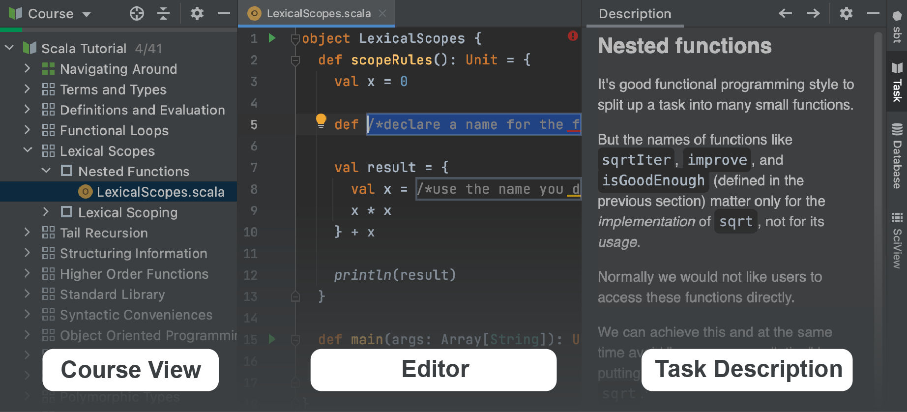

# EduTools plugin overview

This lesson will help you take your first steps with the [EduTools plugin](https://www.jetbrains.com/help/education/educational-products.html) and use it to learn Scala.

With the EduTools plugin, you can learn programming languages and tools by completing coding tasks and get instant feedback right inside the IDE.

Enough talking – let's get started!

If you're already familiar with the interface, you can skip this lesson.

## Working with courses
  
  Every course available in EduTools is structured as a list of lessons. Lessons, in turn, can be grouped into sections. Each lesson contains several tasks.
  
  When you open a course, you will see the main tool windows used for navigation: 
  **Project View**, **Editor**, and **Task Description**:

  
  
Click the "Next" button to navigate to the next task.