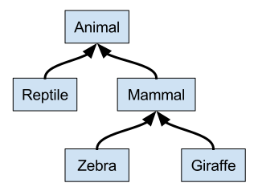

Remember the definition of `IntSet` (in section [Object Oriented Programming](course://Object Oriented Programming)):

      abstract class IntSet {
        def incl(x: Int): IntSet
        def contains(x: Int): Boolean
      }

## Type Parameters

It seems too narrow to define only sets with `Int` elements.

We'd need another class hierarchy for `Double` lists and so on,
one for each possible element type.

We can generalize the definition using a *type parameter*:

      abstract class Set[A] {
        def incl(a: A): Set[A]
        def contains(a: A): Boolean
      }
      class Empty[A] extends Set[A] {
        …
      }
      class NonEmpty[A](elem: A, left: Set[A], right: Set[A]) extends Set[A] {
        …
      }

Type parameters are written in square brackets, e.g., `[A]`.

## Generic Functions

Like classes, functions can have type parameters.

For instance, here is a function that creates a set consisting of a single element:

      def singleton[A](elem: A) = new NonEmpty[A](elem, new Empty[A], new Empty[A])

We can then write:

      singleton[Int](1)
      singleton[Boolean](true)

## Type Inference 

In fact, the Scala compiler can usually deduce the correct type
parameters from the value arguments of a function call.

So, in most cases, type parameters can be left out. You could also write:

      singleton(1)
      singleton(true)

## Types and Evaluation

Type parameters do not affect evaluation in Scala.

We can assume that all type parameters and type arguments are removed
before evaluating the program.

This is also called *type erasure*.

Languages that use type erasure include Java, Scala, Haskell, ML, and OCaml.

Some other languages keep the type parameters around at run time; these include C++, C#, and F#.

## Polymorphism 

Polymorphism means that a function type comes "in many forms".

In programming, it means that

 - the function can be applied to arguments of many types, or
 - the type can have instances of many types.

We have seen two principal forms of polymorphism:

 - subtyping: instances of a subclass can be passed to a base class;
 - generics: instances of a function or class are created by type parameterization.

The remaining subsections compare their interaction.

Consider the following class hierarchy:

      trait Animal {
        def fitness: Int
      }
    
      trait Reptile extends Animal
    
      trait Mammal extends Animal
    
      trait Zebra extends Mammal {
        def zebraCount: Int
      }
    
      trait Giraffe extends Mammal

## Exercise 

Complete the following implementation of the `size` function, which returns
the size of a given list.
