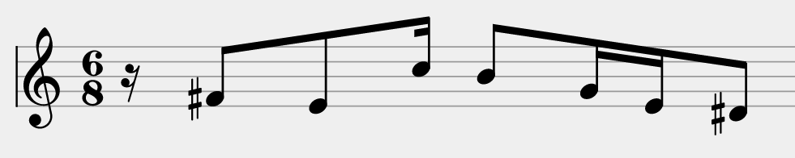

## Introduction

Programs are systems that process information. Therefore, programming
languages provide ways to model the domain of a program.

This section introduces the ways you can structure information in Scala.
We will base our examples on the following domain, a *music sheet*:

### Aggregating Information With Case Classes

First, let’s focus on *notes*. Suppose that in our program, we are
interested in the following properties of notes: their
[name](https://en.wikipedia.org/wiki/Musical_note#12-tone_chromatic_scale )
(A, B, C, etc.), their
[duration](https://en.wikipedia.org/wiki/Note_value) (whole, half,
quarter, etc.), and their octave number.

In summary, our note model *aggregates* several data (name,
duration, and octave). We express this in Scala by using a *case class*
definition:

      case class Note(
        name: String,
        duration: String,
        octave: Int
      )

This definition introduces a new type, `Note`. You can create values
of this type by calling its *constructor*:

      val c3 = Note("C", "Quarter", 3)

`c3` is a value that aggregates the arguments passed to the `Note`
constructor.

Then, you can retrieve the information carried by each *member* (`name`,
`duration`, and `octave`) by using the dot notation.

## Exercise

Complete the setup method for the `C3` Note.
